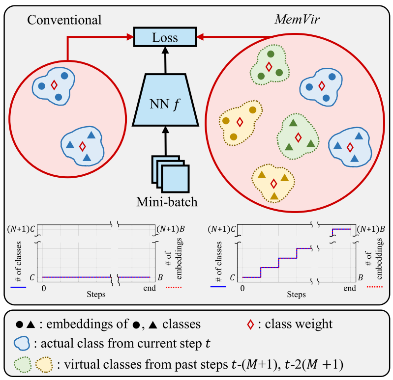

# Learning with Memory-based Virtual Classes for Deep Metric Learning

Official PyTorch implementation of *"Learning with Memory-based Virtual Classes for Deep Metric Learning"* (ICCV 2021)

**Byungsoo Ko\*<sup>1</sup>, Geonmo Gu\*<sup>1</sup>, Han-Gyu Kim<sup>2</sup>** (* Authors contributed equally.)

<sup>1</sup>@NAVER/LINE Vision, <sup>2</sup>@NAVER Clova Speech

- [Paper](https://arxiv.org/abs/2103.16940) | [Presentation](https://youtu.be/s0FcLkE-ZBY) | [PPT](https://www.slideshare.net/ByungSooKo1/iccv2021-learning-with-memorybased-virtual-classes-for-deep-metric-learning-ppt) | [Poster](https://www.slideshare.net/ByungSooKo1/iccv2021-learning-with-memorybased-virtual-classes-for-deep-metric-learning-poster)

## Overview

### MemVir

*MemVir* is a novel training strategy for any softmax variants and proxy-based losses in deep metric learning.
In conventional training, the loss function is computed with actual classes.
On the other hand, in MemVir, classes from previous steps (virtual classes) are used to compute the loss function along with the actual classes.
Moreover, the number of classes and embeddings are gradually increased by adding virtual classes, where C and B denote number of classes and batch size, N and M are hyper-parameters for MemVir. 

<p align="center">
  
</p>

### How it works?

Below figure is t-SNE visualization of 512-dimensional embedding space. 
Embedding features are extracted by model trained with MemVir(5,100) on CARS196 training data.
Each color indicates step for embedding features.
As described in the figure, MemVir offers better utilization of embedding space by alleviating strong focus on seen classes for generalization.


### Experimental results

*MemVir* improves performance for every loss and benchmark dataset.

<p align="center">
  
</p>

## Getting Started

### Installation

1. Clone the repository locally
```bash
$ git clone https://github.com/navervision/MemVir
```

2. Create conda virtual environment
```bash
$ conda create -n memvir python=3.7 anaconda
$ conda activate memvir
```

3. Install pytorch
- [Install pytorch](https://pytorch.org/get-started/locally/) according to your CUDA version
```bash
$ conda install pytorch torchvision cudatoolkit=<YOUR_CUDA_VERSION> -c pytorch
```

4. Install faiss
- We use [faiss](https://github.com/facebookresearch/faiss) library for faster evaluation
- [Install faiss](https://github.com/facebookresearch/faiss/blob/master/INSTALL.md) according to your CUDA version
```bash
$ conda install faiss-gpu cudatoolkit=<YOUR_CUDA_VERSION> -c pytorch
```

5. Install requirements
```bash
$ pip install -r requirements.txt
```

### Prepare Data

- Download [CARS196](https://ai.stanford.edu/~jkrause/cars/car_dataset.html) dataset and unzip

```bash
$ wget http://imagenet.stanford.edu/internal/car196/car_ims.tgz
$ tar zxvf car_ims.tgz -C ./dataset
```

- Rearrange CARS196 directory by following structure
```
# Dataset structure
/dataset/carDB/
  train/
    class1/
      img1.jpeg
    class2/
      img2.jpeg
  test/
    class1/
      img3.jpeg
    class2/
      img4.jpeg
```

```bash
# Rearrange dataset structure
$ python dataset/prepare_cars.py
```

### Train models
- Note that training with MemVir improves performance slowly; thus, it needs larger training epochs than baseline.

#### Norm-SoftMax loss with CARS196

```bash
# Norm-SoftMax
$ python main.py --gpu=0 \
--save_path=./logs/CARS196_norm_softmax \
--data=./dataset/carDB --data_name=cars196 \
--dim=512 --batch_size=128 --epochs=130 \
--freeze_BN --loss=Norm_SoftMax \
--decay_step=50 --decay_stop=50 --n_instance=1 \
--scale=23.0 --check_epoch=5
```

#### MemVir + Norm-SoftMax loss with CARS196

```bash
# MemVir + Norm-SoftMax
$ python main.py --gpu=0 \
--save_path=./logs/CARS196_memvir_norm_softmax \
--data=./dataset/carDB --data_name=cars196 \
 --dim=512 --batch_size=128 --epochs=2000 \
--freeze_BN --loss=NormSoftmax \
--decay_step=2000 --decay_stop=2000 --n_instance=1 \
--scale=23.0 --check_epoch=10 --memvir=1 \
--mem_num_step=45 --mem_step_gap=10 --warm_epoch=40
```

#### Proxy-NCA loss with CARS196

```bash
# Proxy-NCA
$ python main.py --gpu=0 \
--save_path=./logs/CARS196_proxy_nca \
--data=./dataset/carDB --data_name=cars196 \
--dim=512 --batch_size=128 --epochs=130 \
--freeze_BN --loss=Proxy_NCA \
--decay_step=50 --decay_stop=50 --n_instance=1 \
--scale=12.0 --check_epoch=5
```

#### MemVir + Proxy-NCA loss with CARS196

```bash
# MemVir + Proxy-NCA
$ python main.py --gpu=0 \
--save_path=./logs/CARS196_memvir_proxy_nca \
--data=./dataset/carDB --data_name=cars196 \
--dim=512 --batch_size=128 --epochs=2000 \
--freeze_BN --loss=ProxyNCA \
--decay_step=2000 --decay_stop=2000 --n_instance=1 \
--scale=12.0 --check_epoch=10 --memvir=1 \
--mem_num_step=20 --mem_step_gap=25 --warm_epoch=40
```

### Check Test Results
```
$ tensorboard --logdir=logs --port=10000
```

## Experimental results
- We report Recall@1, RP and MAP performances of each loss, which are trained with CARS196 dataset for 5 runs.

### Recall@1
Loss | 1 | 2 | 3 | 4 | 5 | Mean | Diff. | Std.
-- | -- | -- | -- | -- | -- | -- | -- | --
Norm-SoftMax | 83.38 | 83.25 | 83.25 | 83.18 | 83.05 | 83.22 | - | 0.12
MemVir + Norm-SoftMax | 86.36 | 86.05 | 86.26 | 85.92 | 85.95 | 86.11 | +2.89 | 0.19
Proxy-NCA | 83.74 | 83.69 | 83.62 | 83.32 | 83.06 | 83.49 | - | 0.29
MemVir + Proxy-NCA | 86.84 | 85.93 | 86.27 | 85.93 | 85.99 | 86.19 | +2.71 | 0.39

### RP
Loss | 1 | 2 | 3 | 4 | 5 | Mean | Diff. | Std.
-- | -- | -- | -- | -- | -- | -- | -- | --
Norm-SoftMax | 35.85 | 35.51 | 35.28 | 35.28 | 35.24 | 35.43 | - | 0.26
MemVir + Norm-SoftMax | 38.61 | 38.27 | 38.31 | 38.02 | 38.25 | 38.29 | +2.86 | 0.21
Proxy-NCA | 36.08 | 35.85 | 35.79 | 35.66 | 35.66 | 35.81 | - | 0.17
MemVir + Proxy-NCA | 38.11 | 38.02 | 37.90 | 37.79 | 38.03 | 37.97 | +2.16 | 0.13

### MAP
Loss | 1 | 2 | 3 | 4 | 5 | Mean | Diff. | Std.
-- | -- | -- | -- | -- | -- | -- | -- | --
Norm-SoftMax | 25.56 | 25.56 | 25.00 | 24.93 | 24.90 | 25.19 | - | 0.34
MemVir + Norm-SoftMax | 28.73 | 28.47 | 28.53 | 28.12 | 28.44 | 28.46 | +3.27 | 0.22
Proxy-NCA | 25.66 | 25.52 | 25.37 | 25.36 | 25.33 | 25.45 | - | 0.14
MemVir + Proxy-NCA | 28.40 | 28.04 | 28.10 | 28.16 | 28.14 | 28.17 | +2.72 | 0.14

## Reference
- Our code is based on Proxy Synthesis ([Arxiv](https://arxiv.org/abs/2103.15454), [Github](https://github.com/navervision/proxy-synthesis)) and SoftTriple ([Arxiv](https://arxiv.org/abs/1909.05235), [Github](https://github.com/idstcv/SoftTriple)).

## Citation
If you find *MemVir* useful in your research, please consider to cite the following paper.

```
@inproceedings{ko2021learning,
    title={Learning with Memory-based Virtual Classes for Deep Metric Learning},
    author={Byungsoo Ko, Geonmo Gu, and Han-Gyu Kim},
    booktitle={Proceedings of the IEEE/CVF International Conference on Computer Vision (ICCV)},
    year={2021}
}
```

## License

```
Copyright 2021-present NAVER Corp.

Licensed under the Apache License, Version 2.0 (the "License");
you may not use this file except in compliance with the License.
You may obtain a copy of the License at

    http://www.apache.org/licenses/LICENSE-2.0

Unless required by applicable law or agreed to in writing, software
distributed under the License is distributed on an "AS IS" BASIS,
WITHOUT WARRANTIES OR CONDITIONS OF ANY KIND, either express or implied.
See the License for the specific language governing permissions and
limitations under the License.
```   
